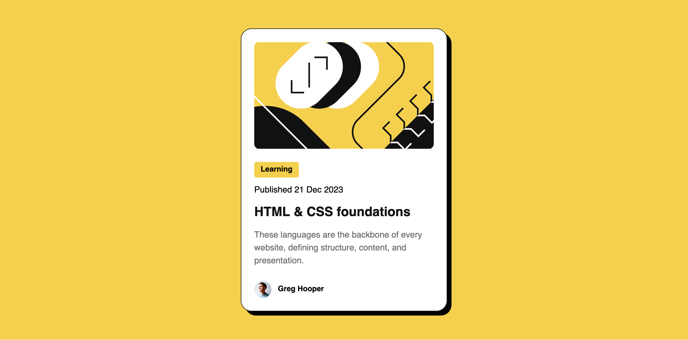

# Frontend Mentor - Blog preview card solution

This is a solution to the [Blog preview card challenge on Frontend Mentor](https://www.frontendmentor.io/challenges/blog-preview-card-ckPaj01IcS). Frontend Mentor challenges help you improve your coding skills by building realistic projects.

## Table of contents

- [Overview](#overview)
  - [The challenge](#the-challenge)
  - [Screenshot](#screenshot)
  - [Links](#links)
- [Process](#Process)
  - [What I learned](#what-i-learned)
  - [Useful resources](#useful-resources)

## Overview

### The challenge

Users should be able to:

- See hover and focus states for all interactive elements on the page
- View the design on all screen sizes
- Bonus challenge: the font should be smaller on smaller screens without using media queries

### Screenshot

### Links

- Solution URL: [Github](https://github.com/Donahuec/frontend-mentor-blog-preview-card)
- Live Site URL: [Github Pages](https://donahuec.github.io/frontend-mentor-blog-preview-card/)
- Frontend Mentor - [@Donahuec](https://www.frontendmentor.io/profile/Donahuec)

## Process

### What I learned

- Learned about resizing font-sizes based on screen size without using media quieries.

### Useful resources

- [Fluid Type Generator](https://fluid.style/type) - Generates a clamp method for font sizes that change depending on the screen size.
